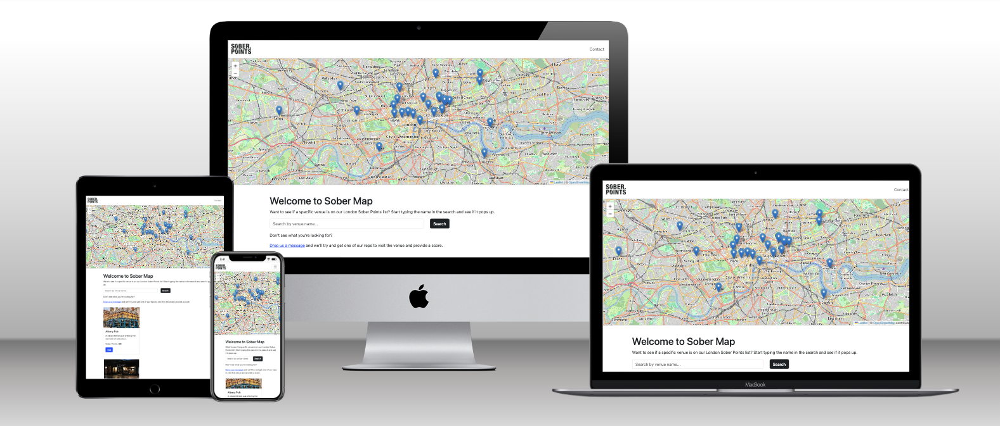

# Sober Map

## Table of Contents
- [Introduction](#introduction)
- [Technologies Used](#technologies-used)
- [Features](#features)
- [User Stories](#user-stories)
- [Project Structure](#project-structure)
- [Installation and Setup](#installation-and-setup)
- [Deployment](#deployment)
- [My Process](#my-process)
- [Attribution](#attribution)

---

## Welcome to Sober Map
   
**Sober Map** is an interactive front-end website designed to support people in London seeking a sober lifestyle. 

**interactive map** of venues offering good non-alcoholic options, 
The project is built using **HTML5**, **CSS3**, **Bootstrap**, and **JavaScript** with **Leaflet.js** for map interactivity. The website is fully responsive and ensures a seamless user experience across devices.

---

## Technologies Used

- **HTML5**: For semantic structuring of the website.
- **CSS3**: For styling and layout design.
- **Bootstrap**: Used for the grid system, navigation bar, and responsive design components.
- **JavaScript**: Core functionality for interactivity, including:
  - Populating and managing map markers.
  - Enabling a dynamic search bar for venues.
  - Handling DOM manipulation and user inputs.
- **Leaflet.js**: A JavaScript library for interactive maps.
- **Google Fonts**: Fonts such as **Poppins** and **Roboto** for readability and aesthetics.

---

## Features

- **Interactive Map**:
  - Displays venues across London with good non-alcoholic drink options.
  - Custom map markers with popups showing venue details like name, area, and rating.
- **Venue Search**:
  - A dynamic search bar allowing users to filter venues by name.
  - Real-time updates to display matching venues.
- **Contact Form**:
  - Users can submit feedback or request the addition of venues.
- **Navigation Bar**:
  - Users can easily navigate between the homepage and contact page using the Navbar, removing any need to use the back button.
- **Responsive Design**:
  - Ensures compatibility with mobile and desktop devices.

---

## User Stories

### User Story 1: Exploring Venues
**As a user**, I want to explore venues that offer non-alcoholic drink options, so I can find suitable places to socialise without alcohol.
- **Implementation**: The interactive map lists venues with details and links for further information.

### User Story 2: Searching for a Venue
**As a user**, I want to search for a specific venue by name, so I can quickly find information on places I’m interested in.
- **Implementation**: A search bar dynamically filters the venue list and updates the display.

### User Story 3: Providing Feedback
**As a user**, I want to contact the site creators to suggest new venues or ask questions, so I can contribute to the growing community.
- **Implementation**: The Contact page includes a form for user messages.

---

## Project Structure

### Files and Folders
- **index.html**: The main Home page with the interactive map and podcasts.
- **contact.html**: A form-based Contact page for user feedback.
- **assets/**:
  - **images/**: Venue images and hero images.
- **css/**: Custom stylesheets for the website.
- **scripts/**:
  - `script.js`: Contains JavaScript for map interactivity and venue search.

---

## Installation and Setup

1. Clone the repository:
   ```bash
   git clone https://github.com/shipleyux/sober-map.git
   ```
2. Open the project folder in your code editor.
3. Open `index.html` in your browser to view the Home page.
4. Ensure you're connected to the internet for external libraries like Bootstrap and Leaflet.js.

---

## Deployment

To deploy the Sober Map project, follow these steps:

1. **Prepare the Project**:
   - Ensure all your files are updated and tested locally.
   - Ensure that external libraries (e.g., Bootstrap, Leaflet.js) are correctly linked.

2. **Push to GitHub**:
   - Add all changes to your repository:
     ```bash
     git add .
     git commit -m "Prepare for deployment"
     git push origin main
     ```

3. **Enable GitHub Pages**:
   - Navigate to your repository on GitHub.
   - Go to **Settings** > **Pages**.
   - Under "Source," select the `main` branch and click **Save**.
   - GitHub will generate a URL for your site (e.g., `https://username.github.io/repository-name`).

4. **Test the Deployment**:
   - Open the GitHub Pages URL in your browser.
   - Verify that all pages, links, and assets load correctly.

5. **Find this site**:
   - Visit the following link:
   - https://shipleyux.github.io/sober-map

The deployed project will now be accessible via the GitHub Pages URL provided.

---
## My Process

When working on the map functionality, I needed to display all the venues dynamically. Initially, it felt overwhelming, but I realised the venues could be stored in a list, and JavaScript could be used to go through each one automatically.

By creating a structured list of venue details (like name, location, and rating), I was able to use a simple loop to handle them all. For each venue in the list, the code would add a marker to the map and display the details in a popup. This made the process feel manageable and gave me a lot of control over how each venue appeared on the map.

Later, when working on the search bar, I noticed a small issue where typing part of a venue’s name could bring up multiple results that weren’t relevant. To fix this, I changed the search functionality to check if the venue names **start with** the search term, rather than just checking if they **include** it. This made the results more precise and avoided confusion.

## Attribution

- **Images**: Venue images and contact page header image are sourced from respective websites and Unsplash.
- **JavaScript Libraries**:
  - **Leaflet.js**: Used for map interactivity and code snippet to set map boundaries for London.
  - **Bootstrap**: Used for responsive design.
- **Google Fonts**: Fonts sourced from [Google Fonts](https://fonts.google.com).

Special thanks to Spencer Bariball for his guidance throughout this project.
