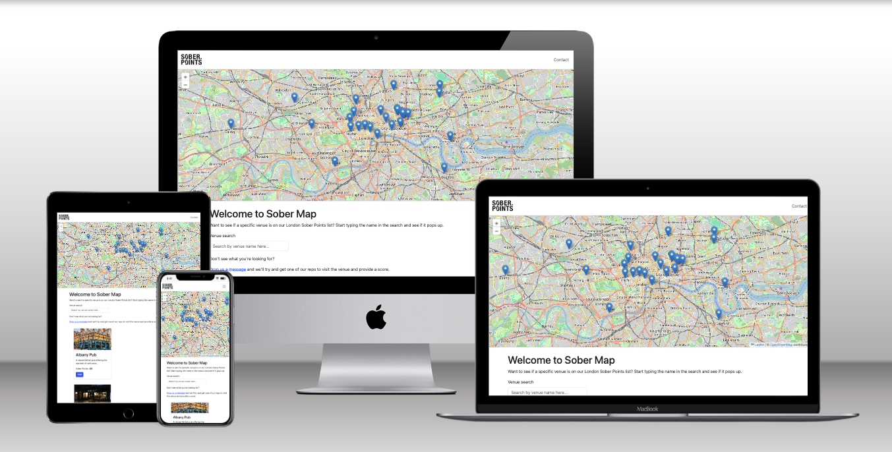

# Sober Map

## Table of Contents
- [Welcome to Sober Map](#welcome-to-sober-map)
- [Technologies Used](#technologies-used)
- [Features](#features)
- [User Stories](#user-stories)
- [Wireframes](#wireframes)
- [Project Structure](#project-structure)
- [Installation and Setup](#installation-and-setup)
- [Deployment](#deployment)
- [Code Validation Testing](#code-validation-testing)
- [Accessibility Testing](#accessibility-testing)
- [Manual User Testing](#manual-user-testing)
- [My Javascript Process](#my-process)
- [Resubmission Enhancements](#resubmission-enhancements)
- [Attribution](#attribution)

---

## Welcome to Sober Map



**Sober Map** is an interactive front-end website designed to support people in London seeking a sober lifestyle. It features an **interactive map** of venues offering great non-alcoholic options.

The project is built using **HTML5**, **CSS3**, **Bootstrap**, and **JavaScript**, with **Leaflet.js** used to power the map functionality. The site is fully responsive and provides a smooth user experience across all devices.

- [View the Live Site](https://shipleyux.github.io/sober-map/)
- [Clone the Repo](https://github.com/shipleyux/sober-map.git)


---

## Technologies Used

- **HTML5**: For semantic structuring of the website.
- **CSS3**: For styling and layout design.
- **Bootstrap**: Used for the grid system, navigation bar, and responsive design components.
- **JavaScript**: Core functionality for interactivity, including:
  - Populating and managing map markers.
  - Enabling a dynamic search bar for venues.
  - Handling DOM manipulation and user inputs.
- **Leaflet.js**: A JavaScript library for interactive maps.
- **Google Fonts**: Fonts such as **Poppins** and **Roboto** for readability and aesthetics.

---

## Features

- **Interactive Map**:
  - Displays venues across London with good non-alcoholic drink options.
  - Custom map markers with popups showing venue details like name, area, and rating.
- **Venue Search**:
  - A dynamic search bar allowing users to filter venues by name.
  - Modal popups with venue information.
  - Real-time updates to display matching venues.
- **Contact Form**:
  - Users can submit feedback or request the addition of venues.
- **Navigation Bar**:
  - Users can easily navigate between the homepage and contact page using the Navbar, removing any need to use the back button.
- **Responsive Design**:
  - Ensures compatibility with mobile and desktop devices.

---

## Wireframes
These wireframes show the early ideas for how the site would look and work. They helped me plan the layout, features, and user journey before building the site.


---

## User Stories

### User Story 1: Exploring Venues
**As a user**, I want to explore venues that offer non-alcoholic drink options, so I can find suitable places to socialise without alcohol.
- **Implementation**: The interactive map lists venues with details and links for further information.

### User Story 2: Searching for a Venue
**As a user**, I want to search for a specific venue by name, so I can quickly find information on places I’m interested in.
- **Implementation**: A search bar dynamically filters the venue list and updates the display.

### User Story 3: Providing Feedback
**As a user**, I want to contact the site creators to suggest new venues or ask questions, so I can contribute to the growing community.
- **Implementation**: The Contact page includes a form for user messages.

---

## Project Structure

### Files and Folders
- **index.html**: The main Home page with the interactive map.
- **contact.html**: A form-based Contact page for user feedback.
- **assets/**: Venue images.
- **css/**: Custom stylesheets for the website.
  - `styles.css`: Contains custom styling for homepage.
  - `contact.css`: Contains custom styling for contact page.
- **scripts/**:
  - `script.js`: Contains JavaScript for map interactivity and venue search.
  - `contact.js`: Contains JavaScript for contact page submission feedback modal.

---

## Installation and Setup

1. Clone the repository:
   ```bash
   git clone https://github.com/shipleyux/sober-map.git
   ```
2. Open the project folder in your code editor.
3. Open `index.html` in your browser to view the Home page.
4. Ensure you're connected to the internet for external libraries like Bootstrap and Leaflet.js.

---

## Deployment

To deploy the Sober Map project, follow these steps:

1. **Prepare the Project**:
   - Ensure all your files are updated and tested locally.
   - Ensure that external libraries (e.g., Bootstrap, Leaflet.js) are correctly linked.

2. **Push to GitHub**:
   - Add all changes to your repository:
     ```bash
     git add .
     git commit -m "Prepare for deployment"
     git push origin main
     ```

3. **Enable GitHub Pages**:
   - Navigate to your repository on GitHub.
   - Go to **Settings** > **Pages**.
   - Under "Source," select the `main` branch and click **Save**.
   - GitHub will generate a URL for your site (e.g., `https://username.github.io/repository-name`).

4. **Test the Deployment**:
   - Open the GitHub Pages URL in your browser.
   - Verify that all pages, links, and assets load correctly.

5. **Find this site**:
   - Visit the following link:
   - https://shipleyux.github.io/sober-map

The deployed project will now be accessible via the GitHub Pages URL provided.

---

## Code Validation Testing
<details>
  <summary><strong>HTML Validator</strong></summary>

  **Errors Found**  
  

  **Fixes**  
  - Removed container element  
  - Removed rogue paragraph tag  
  - Removed redundant `/` from Leaflet link  
  - Moved `ul` tag to make structure compliant  

</details>

<details>
  <summary><strong>Index Page Pass After Fixes</strong></summary>

  

</details>

<details>
  <summary><strong>Contact Page Pass</strong></summary>

  

</details>

<details>
  <summary><strong>CSS Pass</strong></summary>

  

</details>

<details>
  <summary><strong>JSLint</strong></summary>

  **Fixes Implemented**
  - Use 4 spaces for each level of indentation  
  - Correct placement of braces  
  - Remove trailing spaces  
  - Add one space after commas in arrays and objects  
  - Correct function formatting  
  - Use double quotes instead of single quotes for strings  
  - Remove extra spaces between elements  
  - Add missing global declaration for the Leaflet API  

  

</details>


## Lighthouse Analysis ##

<details>
  <summary><strong>Home Page</strong></summary>

  ### Lighthouse Performance Summary

  The Lighthouse Performance score for the deployed site is **72**, with Accessibility at **96**, Best Practices at **96**, and SEO at **91**.

  

  #### Identified Issue:
  - **Largest Contentful Paint (LCP)** is the primary factor lowering the performance score.
  - The interactive **Leaflet.js map** component is the LCP element and contributes significantly to load time.
  - Optimisation opportunities flagged include:
    - Preloading the LCP image  
    - Using next-gen formats  
    - Minimising unused CSS and JavaScript  

  #### Actions Taken:
  - Deferred map rendering using a `setTimeout` to delay load  
  - Used `map.invalidateSize()` after layout shifts to improve visibility  
  - Preloaded hero image (when used)  
  - Reduced map container size on smaller screens and optimised image dimensions  
  - Checked for unused CSS and minified styles where possible  
  - **Replaced the default OpenStreetMap tile layer with [Carto Light (no labels)](https://carto.com)**, a lightweight and visually minimal basemap  

  #### Outcome:
  Despite these changes, the LCP remains tied to the map rendering process. The map is critical to the application’s function, and removing or replacing it would compromise UX.

  > The map loads successfully across all tested devices and remains fully interactive. There is **no visible lag or broken layout**, and **usability remains high**. The slight performance drop does not affect accessibility, interactivity, or functionality.

  **Conclusion:**  
  Performance optimisations have been documented and implemented where feasible. Further gains would require server-side improvements or map abstraction. The application remains compliant with the learning outcome criteria.

</details>

<details>
  <summary><strong>Contact Page</strong></summary>

  

</details>


## Accessibility Testing

<details>
  <summary><strong>Home Page</strong></summary>

  **Fixes**  
  - Changed all `<h5>` tags to `<h2>` to avoid skipped heading levels  
  - Added `<label>` tag to search bar  

  

</details>

<details>
  <summary><strong>Contact Page</strong></summary>

  

</details>

## Manual User Testing

<details>
  <summary><strong>View Manual Testing Summary</strong></summary>

  I’ve written this Manual Testing Report to show how I tested each fix and made sure everything worked properly across the site.  
  Most of the bugs I came across were around layout issues and modal behaviour.

  They’ve all been logged in more detail in the [Bug Fix Report](bug-report.md),  
  but this file (the [Manual Testing Report](testing.md)) walks through how I spotted them, what I expected to happen, and how I confirmed each one was resolved after making changes.

</details>


### As a site visitor

| User Story | Acceptance Criteria / Tests Performed |
|------------|----------------------------------------|
| I want to view a list of sober-friendly venues | - Venue cards load on page visit<br>- Each card displays venue name, image, short description, Sober Points, and link<br>- All venues appear consistently across reloads |
| I want to search for a specific venue by name | - Typing into the search bar filters results live<br>- Matching venues stay visible; others are hidden<br>- Clearing the input resets the full list |
| I want to click a “More Info” button to see extra details | - Clicking "More Info" triggers a Bootstrap modal<br>- Modal displays custom content based on the clicked venue<br>- Modal closes properly on clicking "X" or outside area |
| I want to view venues on an interactive map | - Leaflet map initialises on page load<br>- Pins appear for each venue with correct coordinates<br>- Clicking a pin shows popup with venue title, Sober Points, and area |
| I want the layout to work on both desktop and mobile | - Tested on various screen sizes using browser dev tools<br>- Map and venue list stack vertically on mobile<br>- Navigation is accessible via a toggler on smaller screens |

### As a content editor (admin)

| User Story | Acceptance Criteria / Tests Performed |
|------------|----------------------------------------|
| I want to update venue info without breaking the modal | - Venue details (title, description, opening times) are added using `data-*` attributes in the HTML<br>- No JavaScript changes are required per venue update<br>- Non-breaking HTML tags (e.g., `<p>`, `<br>`, `<strong>`) render safely in modals |
| I want to ensure all modals work dynamically | - Reusable Bootstrap modal displays unique content for each venue<br>- Modal updates dynamically based on button’s `data-title`, `data-body`, and `data-link`<br>- Tested multiple venues to confirm no conflict or overlap |


   

## My Javascript Process

When working on the map functionality, I needed to display all the venues dynamically. Initially, it felt overwhelming, but I realised the venues could be stored in a list, and JavaScript could be used to go through each one automatically.

By creating a structured list of venue details (like name, location, and rating), I was able to use a simple loop to handle them all. For each venue in the list, the code would add a marker to the map and display the details in a popup. This made the process feel manageable and gave me a lot of control over how each venue appeared on the map.

Later, when working on the search bar, I noticed a small issue where typing part of a venue’s name could bring up multiple results that weren’t relevant. To fix this, I changed the search functionality to check if the venue names **start with** the search term, rather than just checking if they **include** it. This made the results more precise and avoided confusion.

## Resubmission Enhancements

Following feedback, I made several improvements to the project to enhance usability, layout, and overall user experience:

- **Improved Venue Listing Layout:**  
  I introduced a scrollable div and a responsive grid layout for the venue cards to make browsing smoother, especially on smaller screens.

- **Interactive Venue Modals:**  
  Instead of linking out to venue websites, each venue card now opens a modal popup with detailed information (like alcohol-free options and opening times). This creates a more engaging experience without taking users off the page.

- **Contact Form Confirmation Modal:**  
  After submitting the contact form, users now see a confirmation modal that auto-closes after a few seconds. This gives clear feedback and improves the flow.

- **Hero Image Fix:**  
  I fixed the broken hero image on the contact page so the layout now matches the rest of the site and looks more polished.

- **Added a custom favicon:** 
Converted the project logo into a `.ico` format and added it to the site root. This eliminates the default 404 favicon error and improves site polish by displaying a branded icon in browser tabs.

All of these changes were tested manually and are logged in both the [Bug Fix Report](bug-report.md) and [Manual Testing Report](testing.md).


## Attribution

- **Images**: Venue images and contact page header image are sourced from respective websites and Unsplash.
- **JavaScript Libraries**:
  - **Leaflet.js**: Used for map interactivity and code snippet to set map boundaries for London.
  - **Carto Lite**: Tile layer source from carto.com, used ny leaflets api. 
  - **Bootstrap**: Used for responsive design.
- **Google Fonts**: Fonts sourced from [Google Fonts](https://fonts.google.com).


Special thanks to Spencer Bariball for his guidance throughout this project.
